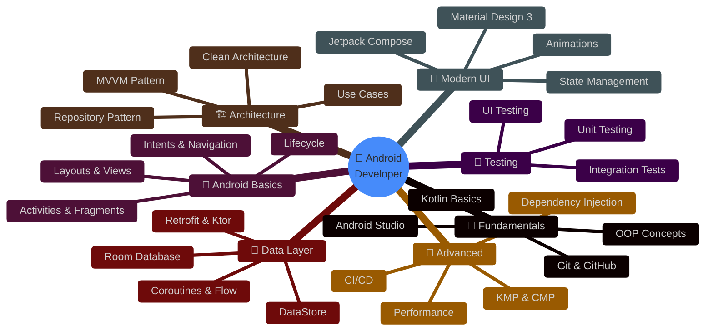
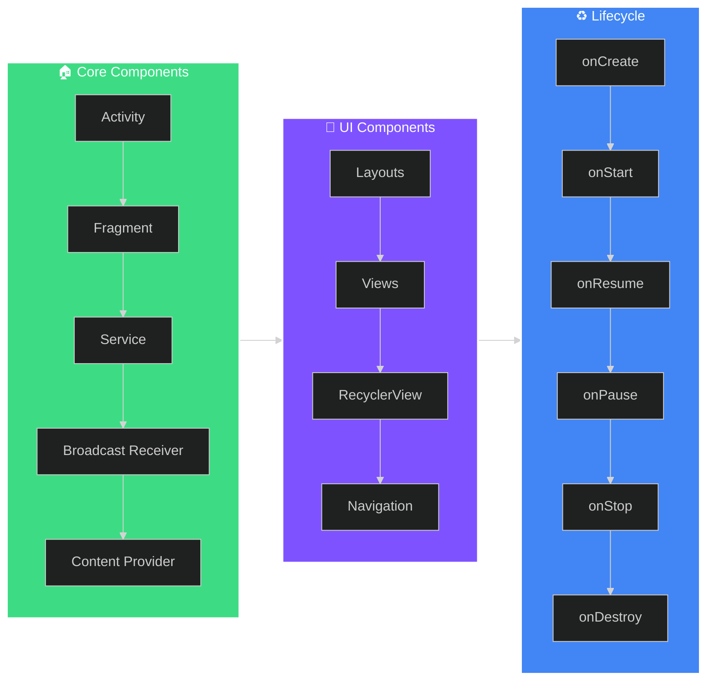
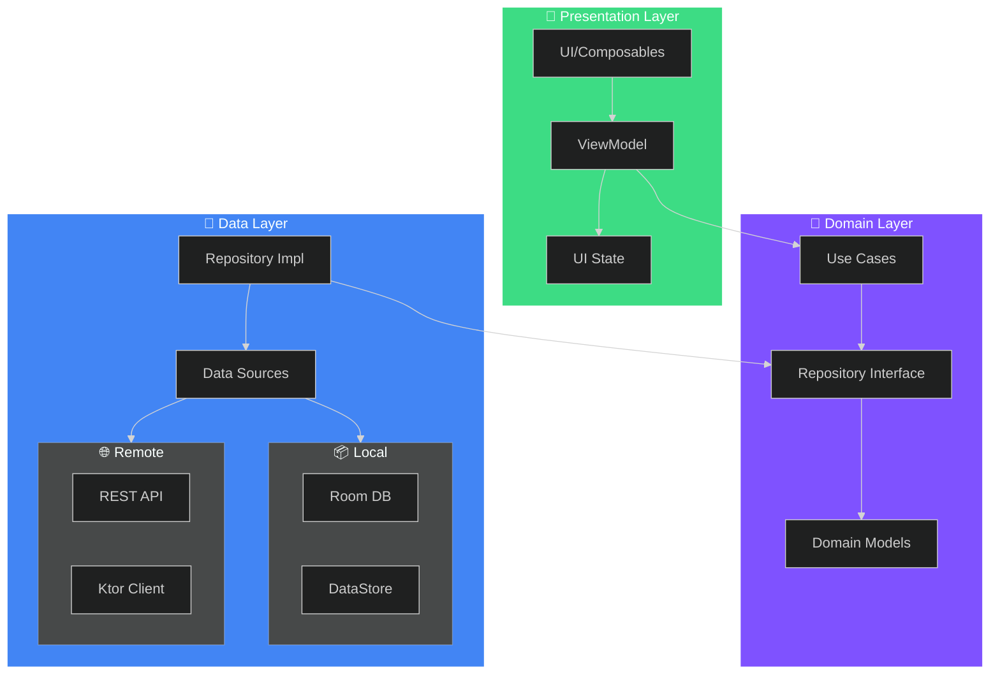
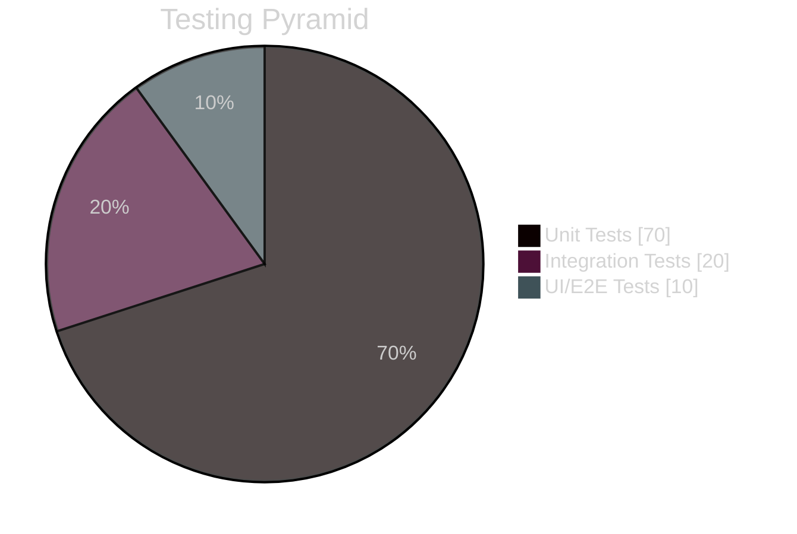

<div align="center">

# 🚀 Android Developer Roadmap 2026


[](https://developer.android.com/)
[](https://kotlinlang.org/)
[](https://developer.android.com/jetpack/compose)
[](https://firebase.google.com/)
[](LICENSE)

### *Your Complete Guide to Becoming an Android Engineer in 2026*

</div>

---

## 📑 Table of Contents

| # | Phase | Topics |
|:-:|:------|:-------|
| 1 | [📘 Fundamentals](#-phase-1-fundamentals) | Kotlin, OOP, Git, Android Studio |
| 2 | [📱 Android Basics](#-phase-2-android-basics) | Activities, Fragments, Lifecycle, Intents |
| 3 | [🎨 Modern UI](#-phase-3-modern-ui-with-jetpack-compose) | Jetpack Compose, Material 3, Animations |
| 4 | [🏗️ Architecture](#️-phase-4-architecture) | MVVM, Clean Architecture, Repository |
| 5 | [💾 Data Layer](#-phase-5-data-layer) | Room, DataStore, Retrofit, Coroutines |
| 6 | [🧪 Testing](#-phase-6-testing) | Unit Tests, UI Tests, Integration |
| 7 | [🚀 Advanced](#-phase-7-advanced-topics) | DI, KMP, Performance, CI/CD |

**Quick Links:** [🛠️ Essential Libraries](#️-essential-libraries) • [📚 Resources](#-resources) • [🤝 Contributing](#-contributing) • [📬 Connect](#-connect-with-me)

---

## 📱 Overview


Welcome to the **Ultimate Android Developer Roadmap 2026**! 

This comprehensive guide walks you through everything you need to become a professional Android Engineer. Whether you're a complete beginner or an experienced developer looking to upgrade your skills, this roadmap has got you covered.

### 🎯 What You'll Learn

- ✨ Modern Kotlin programming
- 📱 Jetpack Compose UI development  
- 🏗️ Clean Architecture patterns
- 🔥 Latest Android technologies
- 🚀 Industry best practices

<br clear="right"/>

---

## 🗺️ Roadmap

<div align="center">

### 📊 Complete Learning Path



</div>

---

## 📘 Phase 1: Fundamentals


### Programming Foundation

| Topic | Description | Duration |
|-------|-------------|----------|
| 🟣 **Kotlin** | Primary language for Android | 3-4 weeks |
| 📦 **OOP Concepts** | Classes, Inheritance, Polymorphism | 1-2 weeks |
| 🔄 **Git & GitHub** | Version control essentials | 1 week |
| 🛠️ **Android Studio** | IDE setup and shortcuts | Ongoing |

<details>
<summary>📝 <b>Click to see Kotlin topics to cover</b></summary>

```kotlin
// Essential Kotlin Concepts

✅ Variables & Data Types (val, var)
✅ Null Safety (?., !!, ?:)
✅ Functions & Lambdas
✅ Extension Functions
✅ Higher-Order Functions
✅ Collections (List, Set, Map)
✅ Coroutines Basics
✅ Sealed Classes & Data Classes
✅ Object & Companion Object
✅ Scope Functions (let, run, with, apply, also)
```

</details>

<br clear="right"/>

---

## 📱 Phase 2: Android Basics

<div align="center">



</div>

### 📋 Checklist

- [ ] Understand Activity & Fragment lifecycle
- [ ] Create layouts using XML & Compose
- [ ] Implement RecyclerView/LazyColumn
- [ ] Navigate between screens
- [ ] Handle configuration changes
- [ ] Work with Intents (explicit & implicit)

---

## 🎨 Phase 3: Modern UI with Jetpack Compose


### 🌟 Why Compose?

> *"Jetpack Compose is Android's modern toolkit for building native UI. It simplifies and accelerates UI development."*

```kotlin
@Composable
fun Greeting(name: String) {
    Card(
        modifier = Modifier
            .fillMaxWidth()
            .padding(16.dp),
        elevation = CardDefaults.cardElevation(8.dp)
    ) {
        Text(
            text = "Hello $name! 👋",
            style = MaterialTheme.typography.headlineMedium,
            modifier = Modifier.padding(24.dp)
        )
    }
}
```

### Compose Topics

| Concept | Priority | Description |
|---------|:--------:|-------------|
| 📦 **Composables** | 🔴 | Building blocks of UI |
| 🔄 **State** | 🔴 | remember, mutableStateOf |
| 🎯 **Modifiers** | 🔴 | Styling & positioning |
| 📐 **Layouts** | 🔴 | Column, Row, Box, LazyList |
| 🎭 **Theming** | 🟡 | Material 3, custom themes |
| ✨ **Animations** | 🟢 | animateAsState, transitions |
| 🧭 **Navigation** | 🔴 | NavHost, NavController |
| 📱 **Adaptive UI** | 🟡 | Different screen sizes |

<br clear="right"/>

---

## 🏗️ Phase 4: Architecture

<div align="center">

### Clean Architecture Overview



</div>

### 🎯 MVVM Pattern

```
┌─────────────────────────────────────────────────────────────┐
│                         VIEW                                 │
│  ┌─────────────────┐      ┌─────────────────┐              │
│  │    Composable   │ ◄──► │    UI State     │              │
│  └─────────────────┘      └─────────────────┘              │
└──────────────────────────────┬──────────────────────────────┘
                               │ observes
                               ▼
┌─────────────────────────────────────────────────────────────┐
│                      VIEWMODEL                               │
│  ┌─────────────────┐      ┌─────────────────┐              │
│  │   StateFlow     │      │     Events      │              │
│  └─────────────────┘      └─────────────────┘              │
└──────────────────────────────┬──────────────────────────────┘
                               │ calls
                               ▼
┌─────────────────────────────────────────────────────────────┐
│                       MODEL                                  │
│  ┌─────────────────┐      ┌─────────────────┐              │
│  │   Repository    │ ◄──► │   Data Sources  │              │
│  └─────────────────┘      └─────────────────┘              │
└─────────────────────────────────────────────────────────────┘
```

---

## 💾 Phase 5: Data Layer


### 📊 Storage Options

| Technology | Use Case | Type |
|------------|----------|------|
| **Room** | Complex queries, relations | Local DB |
| **DataStore** | Key-value, preferences | Local |
| **Retrofit** | REST APIs | Network |
| **Ktor** | Modern HTTP client | Network |
| **Proto DataStore** | Type-safe settings | Local |

### 🔄 Coroutines & Flow

```kotlin
// Reactive data streams
viewModelScope.launch {
    repository.getUsers()
        .catch { error -> 
            _uiState.value = UiState.Error(error.message)
        }
        .collect { users ->
            _uiState.value = UiState.Success(users)
        }
}
```

<br clear="right"/>

---

## 🧪 Phase 6: Testing

<div align="center">



</div>

### Testing Stack

| Layer | Tool | Purpose |
|-------|------|---------|
| **Unit** | JUnit5, MockK | Business logic |
| **Integration** | Robolectric | Android components |
| **UI** | Compose Testing | UI interactions |
| **E2E** | Espresso | Full user flows |

---

## 🚀 Phase 7: Advanced Topics

<div align="center">


</div>

### 🎯 Skills to Master

<table>
<tr>
<td width="50%">

#### 💉 Dependency Injection
- **Hilt** (Recommended)
- Koin
- Manual DI

#### 🌍 Kotlin Multiplatform
- Share code across platforms
- Compose Multiplatform for UI
- KMM for business logic

</td>
<td width="50%">

#### ⚡ Performance
- App Startup Library
- Baseline Profiles
- R8 Optimization
- Memory Management

#### 🔄 CI/CD
- GitHub Actions
- Firebase App Distribution
- Play Store Deployment

</td>
</tr>
</table>

---

## 🛠️ Essential Libraries

<div align="center">

| Category | Library | Description |
|:--------:|:-------:|:-----------:|
| 💉 DI |  | Dependency Injection |
| 🌐 Network |  | HTTP Client |
| 🖼️ Images |  | Image Loading |
| 📦 Serialization |  | JSON Parsing |
| 🔄 Async |  | Async Programming |
| 🗄️ Database |  | Local Database |

</div>

---

## 📚 Resources

<div align="center">

### 🎓 Learning Resources

</div>

| Type | Resource | Link |
|------|----------|------|
| 📖 Official | Android Developers | [developer.android.com](https://developer.android.com/) |
| 📖 Official | Kotlin Documentation | [kotlinlang.org](https://kotlinlang.org/docs/home.html) |
| 🎥 Video | Android Developers YouTube | [YouTube](https://www.youtube.com/@AndroidDevelopers) |
| 📰 Blog | Android Developers Blog | [Blog](https://android-developers.googleblog.com/) |
| 📚 Codelabs | Android Codelabs | [Codelabs](https://developer.android.com/courses) |

---

## 🤝 Contributing


Contributions are welcome! Feel free to:

1. 🍴 Fork this repository
2. 🌟 Star this repo
3. 📝 Open issues for suggestions
4. 🔀 Submit pull requests

<br clear="right"/>

---

## 📬 Connect With Me

<div align="center">

[](https://linkedin.com/in/anujsinghdev)
[](https://twitter.com/anujsinghdev)
[](https://anujsinghdev.substack.com)
[](https://youtube.com/@anujsinghdev)

</div>

---

<div align="center">

### ⭐ If this roadmap helped you, please give it a star!


**Made with ❤️ by [Anuj Singh](https://github.com/anujsinghdev)**


</div>
